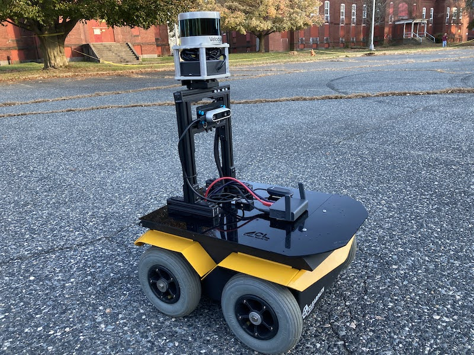

# DCIST Medfield Experiments 
This is a general repository for all of Phoenix-related launch/config files used to operate the Clearpath Jackal during the DCIST Medfield collaborative demo that occured on November 6th, 2020 at the Medfield State Hospital outside of Boston.

Refer to `medfield_game_day_notes.md` for the relavant phoenix commands which relied on files contained herein. Two helper packages were used to aid in communication between the Jackal and the MIT RRG Quadrotor (named `barrel_scout` and `odom_originator`) that are not included in this package.

